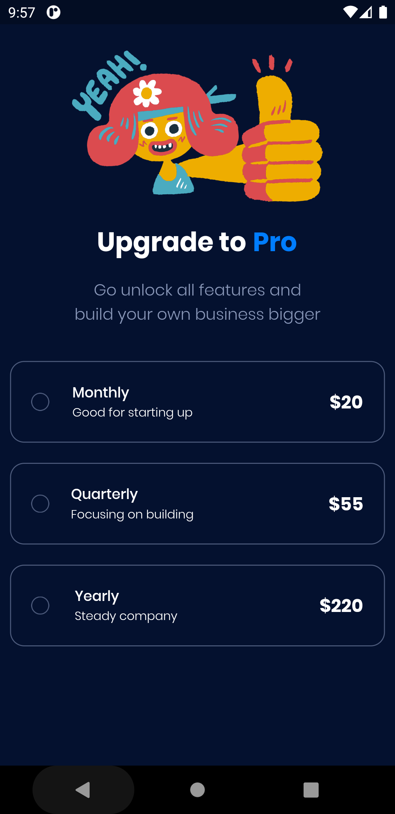
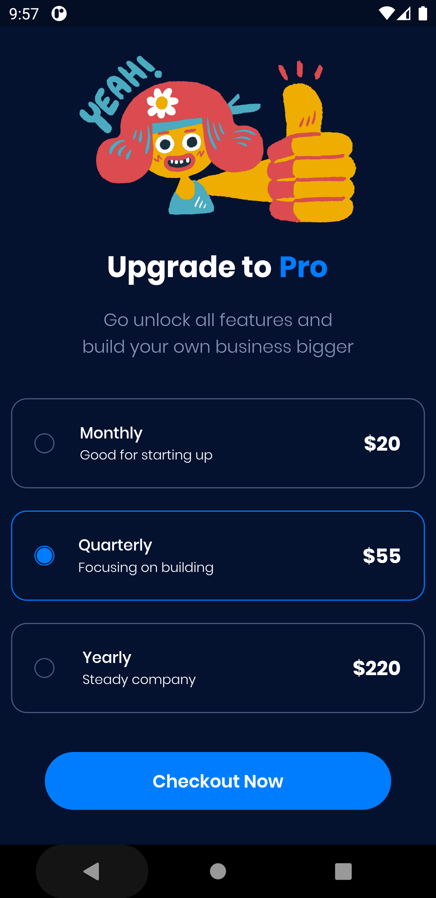

# Payment App

Explore simple State Management in Flutter to build applications that have good User-Experience Design for users. Starting from the slicing design from Figma to the development stage. Made in ❤️ with Flutter.

## Screenshots

<kbd></kbd>
<kbd></kbd>

